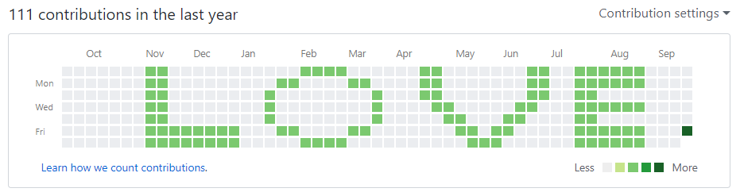

# Github Art

Draw a beautiful pixel art on your github contribution graph.

## How To

    $ python github_art.py <art file name>
    $ git remote add origin <your repo>
    $ git push -u origin master

Check art file format with [sample file](./pixel.txt), it must be [52x7] size.
